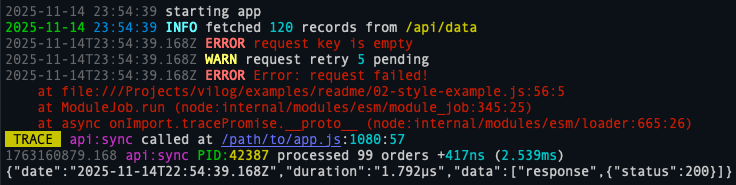

# Vilog

Fast logger for Node.js with pre-compiled layouts, colorized output, and built-in profiling.

```js
import Vilog from 'vilog';

const log = new Vilog({ name: 'app' });

log.info('server started');
log.debug('user %d logged in', 42);
```

## Features

- Pre-compiled layouts with tokens (`{%d}`, `{msg}`, ...) for minimal runtime overhead.
- Built-in profiling tokens `{duration}` and `{uptime}` with human-friendly units.
- Flexible color styling for any token.
- Custom levels with per-level layouts and render functions.
- Silent mode with buffered flush for tests and batch logging.



[Full documentation](../../)